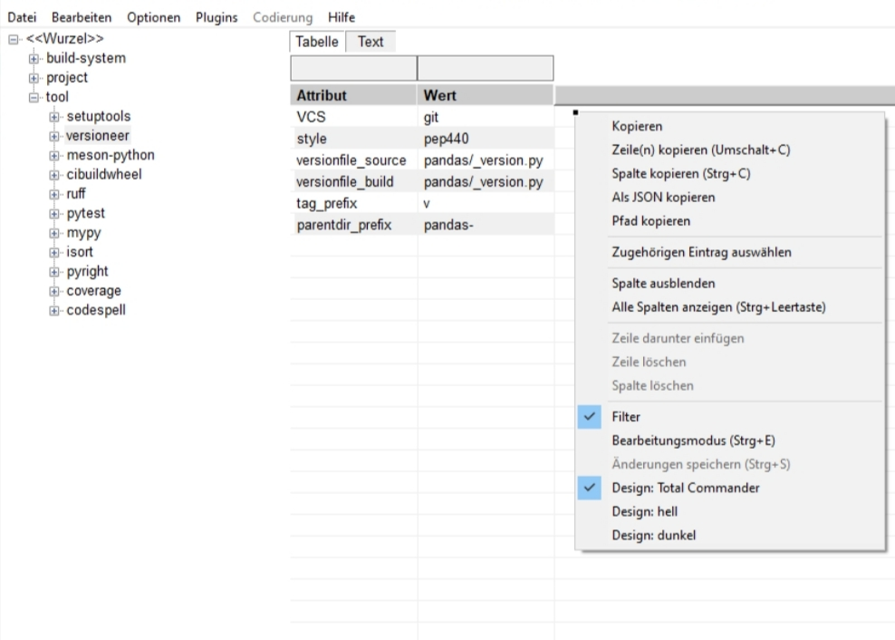

# yamltab



yamltab is a Total Commander Lister plugin for viewing YAML (`.yaml`, `.yml`)
and TOML (`.toml`) files. It provides a tree, a sortable and filterable grid,
and a source-text tab. Its interface is available in English, German, Russian,
and Ukrainian.

## Install

The `yamltab.zip` release archive contains `pluginst.inf` for Total
Commander's plugin installer. Open the archive in Total Commander and follow
its plugin installation prompt. For manual installation:

1. Put these files together in one plugin directory:

   - `yamltab.wlx64` and `yamltab_parser64.dll` for 64-bit Total Commander;
   - `yamltab.wlx` and `yamltab_parser32.dll` for 32-bit Total Commander;
   - `yamltab.en.lng`, `yamltab.de.lng`, `yamltab.ru.lng`, and
     `yamltab.uk.lng` for the localized interface.

   You may keep both architectures in the same directory. **The parser DLL
   matching the WLX architecture is required**; without it, the plugin cannot
   open files.

2. Add the appropriate WLX file in Total Commander's Lister plugin
   configuration. The default detection rule covers `.yaml`, `.yml`, and
   `.toml`. If you set a custom detection rule, do not restrict these text
   formats with `MULTIMEDIA`.
3. Optionally copy `yamltab_default.ini` to `yamltab.ini` in the same directory
   and adjust its settings. Keep any existing `yamltab.ini` when updating the
   plugin unless you intentionally want to replace your preferences.

If you update the WLX while Total Commander is running, close and restart
Total Commander before testing the new version.

## View files

Open a YAML or TOML file in Total Commander's Lister. The tree navigates the
document, the Grid tab displays the selected data, and the Text tab displays
the original source. You can filter and sort grid rows, copy cells or rows,
and switch between light, dark, and Total Commander theme modes from the
grid's context menu.

The default maximum file size is 1,000,000 bytes. Set `max-file-size=0` in
`yamltab.ini` to remove this limit, keeping in mind that very large files may
take longer to open.

## Edit scalar values

1. Enable **Edit mode** from the grid's context menu, or press `Ctrl+E`
   (`Ctrl+R` also toggles it).
2. Double-click an editable grid cell, or select it and press Enter.
3. Enter the new value and press Enter to accept it; press Esc to cancel.
4. Review the pending change in the Text tab. The source file is not changed
   yet.
5. Press `Ctrl+S` or choose **Save changes** from the context menu.

Saving validates the changed YAML or TOML in a temporary file before
replacing the original. The plugin refuses to overwrite a file that changed
externally after it was opened. Local scalar patches preserve comments and
unchanged source text; saving is not a whole-file reformat.

Some cells are deliberately read-only. YAML aliases, anchors, explicit tags,
and block scalars cannot currently be edited directly. TOML editing is
limited to simple assignments whose exact source position is unambiguous;
repeated identical assignments, array elements, and complex constructs may
remain read-only. Inserting or deleting rows, columns, or keys is not yet
available. The Text tab is a preview, not a free-form text editor.

## Language

Set `language` in the `[yamltab]` section of `yamltab.ini`:

```ini
[yamltab]
language=auto
```

Available values are `auto`, `en`, `de`, `ru`, and `uk`. `auto` follows the
Windows user-interface language; other values select a language explicitly.
Reopen the Lister window after changing the setting. English is used as a
fallback when a translation or language file is missing.

## Troubleshooting

- **The plugin does not open the file:** Check that the matching
  `yamltab_parser64.dll` or `yamltab_parser32.dll` is next to the WLX and that
  Total Commander points to the intended plugin directory.
- **Total Commander chooses another viewer:** Check the Lister plugin order
  and the detection rule for YAML/YML/TOML. You can also select yamltab
  explicitly from Lister to test it.
- **A cell cannot be edited:** Its source location or syntax may not be safe
  for a local patch. Edit such cases in a dedicated text editor.
- **A file is too large to open:** Increase `max-file-size` in `yamltab.ini`
  or set it to `0` to disable the limit.
- **Malformed YAML/TOML does not open:** Correct the source in a text editor
  and try again; a dedicated in-plugin parse-error view is not yet available.

yamltab uses libyaml for YAML parsing and tomlc99 for TOML parsing. Their
source code and license files are included under `third_party/`.
